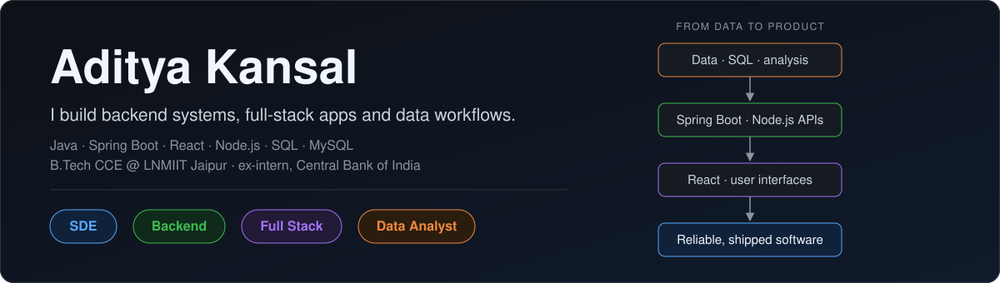
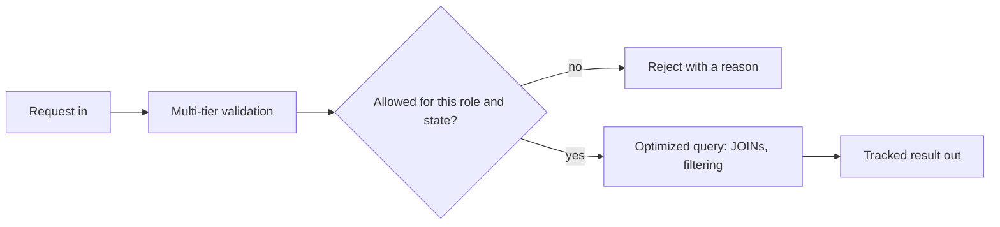

  

  <a href="#-selected-work">Selected work</a> ·
  <a href="#-experience">Experience</a> ·
  <a href="#-what-i-reach-for">Stack</a> ·
  <a href="#-beyond-code">Beyond code</a> ·
  <a href="#-lets-connect">Contact</a>

---

I build backend systems that take messy, high-volume input and turn it into something checked, tracked and fast: registrations that pass compliance rules, forms that generate reports, queries that don't crawl. Java and Spring Boot are my home base, and I build full-stack apps with React and Node.js when the problem needs a UI.

## 🛠️ What I reach for

| Area | Tools | Where it shows up |
|---|---|---|
| **Backend** | Java · Spring Boot · REST APIs · Thymeleaf | Vartalaap Banking, the Central Bank of India pipeline |
| **Full-stack web** | React · TypeScript · Node.js · Express · Tailwind CSS · TanStack Router · HTML/CSS | TableMind, Faculty Appraisal System |
| **Data layer** | MySQL · PostgreSQL (Supabase) · SQL JOINs · query optimization · EAV schema design · Row Level Security | TableMind, Faculty Appraisal System, registration tracking at the bank |
| **Automation** | Puppeteer · Nodemailer | Server-side PDF reports and email workflows |
| **Fundamentals** | Data structures & algorithms in Java and C++ · Git | Real-time filtering in Vartalaap Banking |

## 🧭 The shape of what I build

Validate early, make state transitions explicit, and keep the database work efficient. That pattern shows up in most of what I've built below.

## 🚀 Selected work

| Project | The hard part |
|---|---|
| [**Vartalaap Banking**](https://github.com/Kansal26/spring-boot-bank-portal) `Java` `Spring Boot` `Thymeleaf` `MySQL` | Routing high-volume digital registrations through multi-tier compliance checks, with role-based state machines so records only move through allowed transitions and real-time state filtering stays fast. |
| [**TableMind**](https://github.com/Kansal26/table-mind-magic) `React` `TypeScript` `TanStack Router` `Tailwind` `Supabase` | A QR-based restaurant ordering platform: personalized menus that highlight allergy-safe options, voice ordering, per-dish feedback and an admin dashboard for live orders and sales. Restaurant data is isolated with PostgreSQL Row Level Security, and the schema uses foreign keys and cascading deletes so orphaned records can't exist. |
| [**Faculty Appraisal System**](https://github.com/Sanskriti0805/Faculty_appraisal_system) `React` `Node.js` `Express` `MySQL` `Puppeteer` | Removing N+1 query bottlenecks with SQL JOINs (**~95% faster data retrieval**), an Entity-Attribute-Value schema for highly variable form inputs, and server-side Puppeteer PDF generation for reports. |

## 💼 Experience

| Role | What I did |
|---|---|
| **IT & Data Analyst Intern** Central Bank of India *May – Jul 2025* | Built a Java/Spring Boot pipeline that automated high-volume government scheme registrations (**40% less manual processing time**). Wrote multi-layered compliance validation for applicant data, and optimized MySQL status tracking so far less manual verification was needed. |

## 🌟 Beyond code

| Where | What |
|---|---|
| **Counselling & Guidance Cell, LNMIIT** | Coordinator, leading a 55-member team running mentoring initiatives and activities for 650+ participants (Mar 2025 – Aug 2026) |
| **Debate Society, LNMIIT** | Coordinator, organized LNMIIT MUN 2026 with 150+ delegate registrations across 5+ committees |
| **Entrance exam** | JEE Main 2023: 96.45 percentile |

## 🔭 Currently

- Building full-stack projects with **React, Node.js and TypeScript**
- Deepening my backend skills with **Spring Boot, REST APIs and MySQL**
- Practicing data structures and algorithms in **Java and C++**

## 📫 Let's connect

  
  

<i>Open to internships and collaborations in backend and full-stack development.</i>

